# 🏢 PROJECTE TRANSVERSAL ASIXc1B

---

## 📄 DOCUMENTACIÓ TÈCNICA

### 👥 GRUP 2 &nbsp;&nbsp;|&nbsp;&nbsp;👨‍💻 ASIXc1B

#### 📅 31/05/2025

---

ÍNDEX

[**1. Proposta de CPD	3**](#_viizkamo71pa)

[1.1 Ubicació física	3](#_j8fete62kndm)

[1.2 Infraestructura IT:	10](#_jzl2yhxjrn4)

[1.3 Infraestructura elèctrica:	13](#_smwtkthb0fib)

[1.4 Seguretat física i lògica:	15](#_ht7lpj7g1p0j)

[1.4.1 Física:	15](#_3phz1jlosy68)

[1.4.2 Lògica:	18](#_kankbyjb2cg)

[1.4.3 Prevenció de riscos laborals:	20](#_4csghuwqbj37)

[1.5 Sostenibilitat:	22](#_952hx8hu1s3o)

[1.6 Implementació:	25](#_c4lwpyscku6g)

[Evidencias dels serveis utilitzats en Innocatech:	26](#_8ki60i8bd9ir)

[1.7 Investigar i comparar	31](#_tk8y5rpybimb)

[**2. Evidencia implantació dels serveis d'àudio i vídeo	34**](#_w5rzselz7ut7)

[**3. Evidencia disseny i implementació d’una base de dades	37**](#_2139sc4wtm2m)

[**4. Sostenibilitat	56**](#_ocagsudq5nr3)

[Instàncies EC2	56](#_l6mokwjohbsf)

[A. Optimització de les instàncies EC2:	58](#_62lsq3t44f0g)

[B. Optimització de la base de dades:	58](#_vsy3g5f76u6d)

[C. Optimització del tràfic:	58](#_w8s71qa0h5ug)

[**5. Creació i configuració d'un SIEM	59**](#_ocagsudq5nr4)

# **1. Proposta de CPD**
Cal proposar una solució de CPD que contempli -com a mínim- els següents requeriments:
## **1.1 Ubicació física**
- **Situació física de la sala a l'edifici:** He triat ubicar el CPD a la planta baixa i en una zona interior de l'edifici perquè així evitem riscos innecessaris i optimitzem la seguretat i eficiència. Estar lluny de finestres i façanes ens ajuda a:
  - Evitar que la llum solar escalfi la sala i obligui a fer servir més aire condicionat, reduint la càrrega tèrmica.
  - Reduir les possibilitats d'un robatori o intrusió, ja que l'accés és menys visible i directament accessible des de l'exterior.
  - Prevenir possibles danys per inundacions o filtracions d'aigua des de la coberta, minimitzant el risc d'afectar equips crítics.
  - Mantenir un ambient silenciós i discret, sense pertorbacions externes.
  - Assegurar un entorn de màxima seguretat i control. Tot i que una ubicació en planta baixa podria plantejar un risc menor d'inundació en cas d'un esdeveniment extrem, la nostra ubicació interior, combinada amb el terra tècnic i els sistemes de detecció d'humitat, mitiga significativament aquests perills.

- **Sistemes de climatització (aire condicionat). Nivells de temperatura, humitat i neteja de l'aire:** Per a la climatització del CPD, s'ha optat per una estratègia híbrida i eficient que combina "free cooling" amb sistemes d'aire condicionat d'alta eficiència:
  - **"Free Cooling" Nocturn:** Durant la nit, aprofitarem les temperatures externes més baixes per refredar la sala de forma natural, reduint dràsticament el consum energètic. Aquesta modalitat es gestionarà mitjançant sensors que activaran l'entrada d'aire fresc quan les condicions siguin òptimes.
  - **Sistema d'Aire Condicionat Eficient:** Durant el dia, o quan les condicions externes no permetin el "free cooling", s'utilitzarà un sistema d'aire condicionat basat en unitats InRow o CRAC (Computer Room Air Conditioner) d'alta eficiència amb compressors de velocitat variable. Aquestes unitats estan dissenyades per a gestionar la calor generada per equips IT de manera precisa.
  - **Redundància (N+1):** Per a garantir la disponibilitat contínua, s'implementarà una configuració de redundància N+1 per als sistemes de climatització, assegurant que, en cas de fallada d'una unitat, una altra de reserva pugui prendre el relleu immediatament sense interrupcions.
  - **Nivells Òptims:** Es mantindrà una temperatura constant entre 20∘C i 24∘C i una humitat relativa entre 45% i 55%. Aquests rangs són ideals per al funcionament òptim i la longevitat dels equips IT.
  - **Qualitat de l'Aire:** L'aire serà filtrat constantment mitjançant filtres d'alta eficiència (tipus MERV 13 o superior) per eliminar pols, partícules i contaminants, protegint els components electrònics i millorant l'eficiència dels sistemes de refrigeració.
  - **Monitorització:** Totes les variables ambientals (temperatura, humitat, estat dels filtres) seran monitoritzades en temps real mitjançant sensors connectats a un sistema de gestió d'edificis (BMS - Building Management System) o a una eina de monitorització ambiental específica, amb alertes automàtiques en cas de desviacions.
  - **Gestió del Flux d'Aire:** S'implementarà un disseny de passadissos freds i calents (Cold Aisle Containment - CAC) dins del CPD per optimitzar el flux d'aire, dirigir l'aire fred cap als equips i evacuar l'aire calent de manera eficient, evitant la barreja i millorant l'eficiència de refrigeració.

- **Mesures per dificultar la identificació de la sala:** Per a augmentar la seguretat i la discreció del CPD, s'han implementat les següents mesures:
  - **Accés Ocult:** L'accés a la sala no serà evident des de zones públiques, sinó a través d'un passadís intern amb accés restringit.
  - **Porta de Seguretat:** La porta d'accés serà blindada i ignífuga (certificació EI-60 o superior), sense senyalització externa que indiqui la seva funció.
  - **Control d'Accés:** L'accés es restringirà mitjançant un sistema de control d'accés biomètric (empremta dactilar) combinat amb targeta d'identificació RFID, registrant totes les entrades i sortides amb data, hora i usuari. Aquest sistema permetrà una traçabilitat completa.
  - **Aïllament Acústic i Tèrmic:** Es farà servir panells acústics i tèrmics a les parets per minimitzar qualsevol soroll o emissió de calor perceptible des de l'exterior, fent la sala indetectable.
  - **Discreció Externa:** No hi haurà vents externs prominents ni infraestructures elèctriques visibles des de l'exterior que puguin revelar la presència d'un CPD. Qualsevol element necessari (com ventilacions d'emergència) estarà dissimulat o integrat en el disseny de l'edifici. Aquestes mesures augmentaran significativament la seguretat de la sala i dificultaran qualsevol intent d'identificació o intrusió.

- **Distribució i gestió del cablejat:** Una gestió del cablejat impecable és fonamental per a la mantenibilitat, eficiència i fiabilitat del CPD:
  - **Organització:** S'utilitzaran safates de cables sota el terra tècnic i per sobre del sostre tècnic per organitzar el cablejat d'alimentació i xarxa, mantenint-los separats per evitar interferències electromagnètiques (EMI).
  - **Separació:** Els cables de xarxa i els d'alimentació estaran físicament separats.
  - **Codi de Colors:** Es farà servir un codi de colors estandarditzat per als cables de xarxa (e.g., blau per dades, groc per fibra, vermell per telèfon si fos el cas) i alimentació per a una identificació ràpida.
  - **Etiquetatge:** Tots els cables i ports estaran clarament etiquetats a ambdós extrems, indicant el seu origen i destí, simplificant el manteniment i la resolució de problemes.
  - **Longitud Òptima:** S'utilitzaran cables de la longitud justa necessària per evitar l'excés de cablejat, que pot dificultar la ventilació i l'accés.
  - **Estàndard de Cablejat:** El cablejat de xarxa seguirà l'estàndard TIA/EIA-568 per garantir la compatibilitat i el rendiment.
  - **Fibra Òptica:** Es prioritzarà la fibra òptica per a les connexions de backbone entre racks i per a les connexions d'alta velocitat (10 Gbps o més) entre servidors i switches, especialment donada la necessitat de "Innovate Tech" per a la transmissió de contingut digital i streaming.

- **Terra tècnic i sostre tècnic:**\

  - **Terra Tècnic (Terra Elevat):** S'instal·larà un terra tècnic elevat d'una alçada de 60-90 cm per sobre del terra original. Aquest espai permetrà la gestió ordenada del cablejat (elèctric i de xarxa), les canonades de refrigeració (si n'hi ha), i la distribució de l'aire fred mitjançant perforacions estratègiques al terra. Facilita l'accés per a manteniment, ampliacions i la redirecció eficient de l'aire condicionat. La capacitat de càrrega del terra tècnic serà suficient per suportar el pes dels racks i equips pesats (mínim 1000 kg/m²).
  - **Sostre Tècnic:** Similarment, s'implementarà un sostre tècnic per sobre del sostre original. Aquest espai s'utilitzarà per a la instal·lació de cablejat de xarxa (fibra òptica i coure), sistemes de detecció i extinció d'incendis, sistemes de videovigilància, i la distribució de la il·luminació i conductes de ventilació. Tant el terra com el sostre tècnic contribueixen a un entorn de CPD net, organitzat, segur i escalable.

- **Planells, dibuixos, diagrames dels elements anteriorment citats:**\

  - **Plànol de Distribució Física del CPD:** (Aquí s'inclourà un nou diagrama o una actualització del ja existent, amb més detalls).
    - **Aparició de Hot/Cold Aisles:** Marcar clarament els passadissos freds i calents.
    - **Dimensions:** Afegir dimensions bàsiques de la sala.
    - **Ubicació de PDUs principals:** Senyalitzar la ubicació de les unitats de distribució de potència (PDUs) principals.
    - **Entrada/Sortida de Xarxa Externa:** Indicar els punts d'ingrés/egrés de la connectivitat externa.
    - **Ubicació de Sistemes de Climatització:** Mostrar la posició de les unitats InRow/CRAC.
    - **Rutes d'Evacuació i EPO:** Marcar clarament les vies d'evacuació i els botons d'apagada d'emergència (EPO).
    - **Ubicació de Càmeres i Controls d'Accés:** Dibuixar la posició estratègica de càmeres de seguretat i lectors d'accés.

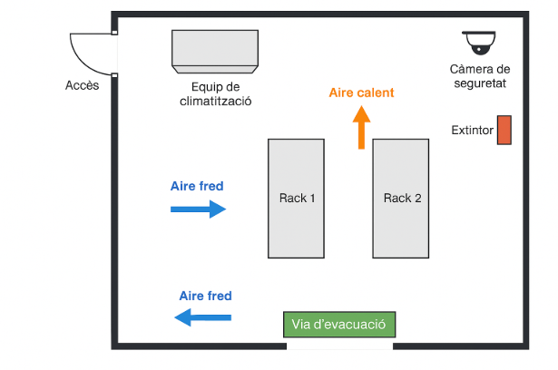

- **Diagrama d'Estructura de Racks (Elevació de Rack):** (Actualitzar els diagrames existents per mostrar):
  - **Unitats "U":** Indicar el nombre d'unitats de rack ("U") que ocupa cada component (servidors, switches, SAIs, patch panels).
  - **Gestió de Cablejat:** Dibuixar com es farà la gestió de cablejat horitzontal i vertical dins dels racks.
  - **Patch Panels:** Detallar la ubicació dels patch panels en relació amb els switches.

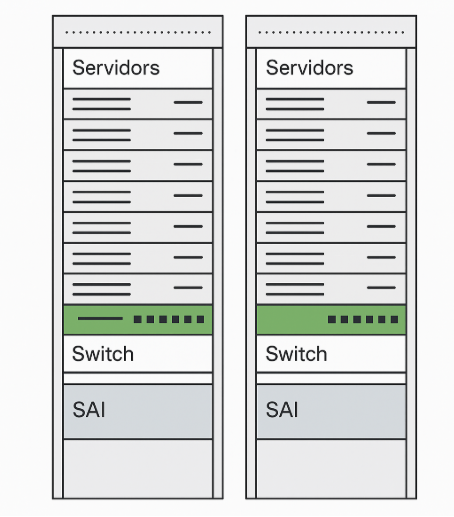

- **Estructuració dels racks (mínim 2 racks):** S'implementaran dos racks de 42U cadascun, assegurant una distribució òptima d'equips i una gestió eficient de l'espai i el cablejat.
  - **Rack 1 (Producció):**
    - **2 Servidors HPE ProLiant DL380 Gen10:** Ubicats a la part central-inferior per estabilitat i flux d'aire.
    - **Switch Principal Cisco Catalyst C9200L-24T-4G:** Situat a l'alçada ideal per a la connexió amb els servidors.
    - **Patch Panels Cat6a de 24 ports:** Un a sobre del switch principal i un a sota, facilitant la connexió amb el cablejat estructurat.
    - **2 SAIs APC Smart-UPS X 2200VA:** A la part inferior del rack, un per cada camí d'alimentació.
    - **Gestió de Cablejat:** S'utilitzaran gestors de cablejat horitzontals i verticals per mantenir l'ordre i evitar l'obstrucció del flux d'aire.

  - **Rack 2 (Backup i Serveis Auxiliars):**
    - **2 Servidors Dell PowerEdge R540:** Ubicats de manera similar als de producció.
    - **Switch de Backup Cisco Catalyst C1000L-8T-2G-L:** Per a la xarxa de backup i gestió.
    - **Patch Panels Cat6a de 24 ports:** Connexió amb el cablejat estructurat i els servidors de backup.
    - **2 SAIs APC Smart-UPS X 2200VA:** També a la part inferior, amb un per cada camí d'alimentació independent.
    - **Consideracions de Pes:** La distribució dels equips dins dels racks es farà considerant el balanç de pes per garantir l'estabilitat i la seguretat del rack. Aquesta estructura permet una clara separació de tasques entre producció i backup, millorant la resiliència i la facilitat de manteniment.
####
####
####
####
####
####
####
####
####
####
####
####
####
####
####
####
####
## **1.2 Infraestructura IT:**
- **Servidors: Número i tipus de model:** Per satisfer les necessitats de "Innovate Tech" en contingut digital i streaming, hem seleccionat els següents servidors:
  - **2 Servidors de Producció:**
    - **Model:** HPE ProLiant DL380 Gen10 (2U)
    - **Processador:** 2 x Intel Xeon Silver 4214R (16 Cores, 2.4 GHz) per servidor, oferint un alt rendiment multitasca.
    - **Memòria RAM:** 256 GB DDR4 2933MT/s (8 x 32GB) per servidor, escalable fins a 3TB, crítica per a càrregues de treball intensives en memòria com bases de dades i processament de vídeo.
    - **Emmagatzematge:** 8 x 3.84TB SAS SSD (Solid State Drives) per servidor, configurats en RAID 10 per a alta velocitat d'I/O i redundància, ideals per a accés ràpid a contingut multimèdia i bases de dades.
    - **Sistema Operatiu:** VMware ESXi (Hypervisor per a virtualització).
    - **Justificació:** Es trien pel seu equilibri entre rendiment, fiabilitat, eficiència energètica i suport empresarial, crucial per a un entorn de producció. La capacitat de virtualització permet maximitzar l'ús de recursos i la flexibilitat.

  - **2 Servidors de Backup/Contingència:**
    - **Model:** Dell PowerEdge R540 (2U)
    - **Processador:** 2 x Intel Xeon Silver 4208 (8 Cores, 2.1 GHz) per servidor, adequat per a tasques de backup i serveis de contingència.
    - **Memòria RAM:** 128 GB DDR4 2666MT/s (4 x 32GB) per servidor.
    - **Emmagatzematge:** 12 x 10TB SATA HDD (Hard Disk Drives) per servidor, configurats en RAID 6 per a gran capacitat i tolerància a fallades de múltiples discos, destinats a l'emmagatzematge de còpies de seguretat a llarg termini.
    - **Sistema Operatiu:** Proxmox VE (Hypervisor de codi obert).
    - **Justificació:** Ofereixen una excel·lent relació qualitat-preu per a l'emmagatzematge de dades de backup i permeten una solució de virtualització robusta.

- **Patch panels:** S'utilitzaran patch panels deleyCON Cat6a de 24 ports, assegurant la compatibilitat amb connexions de fins a 10 Gbps. S'instal·larà un patch panel a la part superior de cada rack de producció i un a cada rack de backup, connectant el cablejat estructurat permanent del terra tècnic amb els ports dels switches i servidors mitjançant latiguillos de longitud reduïda. Això facilita la gestió, la resolució de problemes i la reconfiguració de la xarxa.

*RACK 1:*

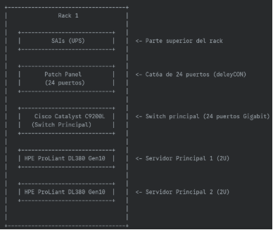

*RACK 2:*

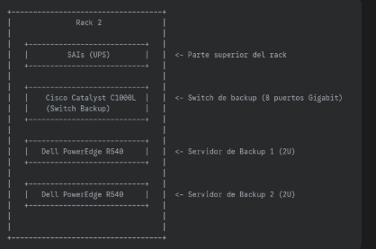

- **Switches:** Per a la infraestructura de xarxa, s'utilitzaran switches Cisco Catalyst, reconeguts per la seva fiabilitat i funcionalitats avançades:
  - **Switch Principal (Rack 1 - Producció):**
    - **Model:** Cisco Catalyst C9200L-24T-4G (24 ports RJ-45 1Gbps, 4 ports SFP+ 10Gbps Uplink)
    - **Funció:** Gestió del trànsit de xarxa principal dels servidors de producció. Els ports SFP+ de 10Gbps s'utilitzaran per a les connexions d'uplink amb el switch del rack de backup i el firewall/router per a connexió externa.
    - **Topologia:** Es configurarà en una topologia de "core-edge" amb un altre switch principal (si hi hagués un segon rack de producció) o directament connectat al firewall. Es farà servir VLANs per segmentar el tràfic (producció, gestió, backup.

- **Switch de Backup (Rack 2 - Backup):**
  - **Model:** Cisco Catalyst C1000L-8T-2G-L (8 ports RJ-45 1Gbps, 2 ports SFP 1Gbps Uplink)
  - **Funció:** Gestió del trànsit de xarxa dels servidors de backup i tasques de gestió. Els ports SFP de 1Gbps s'utilitzaran per a la connectivitat inter-rack i amb el switch principal.
  - **Seguretat:** S'implementaran ACLs (Access Control Lists) i port security en ambdós switches per restringir l'accés no autoritzat i protegir la xarxa interna.
- **Redundància:** Els switches es connectaran amb uplinks redundants (agregació de links si fos necessari) per garantir la continuïtat del servei en cas de fallada d'un enllaç.
- **Planells i diagrames de com estan distribuïts els racks amb els servidors, patch panels i switches:** (Aquest punt remet als diagrames actualitzats i nous que s'han de crear, tal com s'ha descrit a l'apartat 1.1 "Planells, dibuixos, diagrames...")

## **1.3 Infraestructura elèctrica:**
- **Sistemes d'alimentació redundant:** Per garantir la màxima disponibilitat del CPD, s'implementarà un sistema d'alimentació elèctrica totalment redundant (2N), assegurant que cada equip rebi energia de dues fonts independents:
  - **Doble Alimentació:** Tots els servidors i equips de xarxa crítics disposaran de dues fonts d'alimentació (PSUs) redundants.
  - **Camins Elèctrics Independents:** Cada PSU estarà connectada a un camí elèctric totalment independent des de l'origen:
    - **Camí A:** Connectat al correntjat principal de l'edifici (o a una fase diferent) i al SAI 1.
    - **Camí B:** Connectat al correntjat secundari (o a una altra fase independent) i al SAI 2.
  - **PDUs Intel·ligents:** S'utilitzaran Unitats de Distribució de Potència (PDUs) intel·ligents (e.g., amb connexió de xarxa per a monitorització) per a cada rack, que permetran monitoritzar el consum d'energia per presa, realitzar apagat remot i controlar la càrrega per evitar sobrecàrregues.
  - **Panells Elèctrics Dedicats:** El CPD comptarà amb panells elèctrics dedicats, amb interruptors automàtics clarament identificats per a cada camí d'alimentació.
  - **Posada a Terra:** S'implementarà un sistema de posada a terra robust i certificat per a tots els equips i racks, crucial per a la seguretat del personal i per protegir l'electrònica contra interferències i sobretensions.

- **SAIS. Càlcul de quantes bateries o components per tenir els servidors operatius sense corrent elèctric i temps que voleu de funcionament sense senyal elèctric en els servidors:** Per a protegir els equips contra talls de subministrament elèctric i fluctuacions, s'utilitzaran SAIs (Sistemes d'Alimentació Ininterrompuda) redundants.
  - **Càlcul de Càrrega:**
    - **Servidors HPE ProLiant DL380 Gen10:** c. 750W cadascun en càrrega mitjana. (2 servidors x 750W = 1500W)
    - **Servidors Dell PowerEdge R540:** c. 600W cadascun en càrrega mitjana. (2 servidors x 600W = 1200W)
    - **Switches Cisco Catalyst:** c. 100W cadascun. (2 switches x 100W = 200W)
    - **Equips Addicionals (patch panels, monitorització, etc.):** Estimació de 600W.
    - **Càrrega Total Estimada:** 1500W + 1200W + 200W + 600W = **3500W.**
  - **Selecció de SAIs:**
    - S'han escollit dos SAIs models APC Smart-UPS X 2200VA (1980W). Aquests SAIs es connectaran un a cada camí d'alimentació (Camí A i Camí B).
    - **Autonomia Desitjada:** L'objectiu és proporcionar una autonomia de **20-30 minuts** sense subministrament elèctric extern. Aquest temps és suficient per a un apagat ordenat de tots els sistemes crítics en cas de fallada prolongada de la xarxa elèctrica, o per permetre l'engegada d'un sistema de generació d'emergència si n'hi hagués (veure "Suggeriments per a una futura implementació").
    - **Càlcul d'Autonomia:** Amb dos SAIs de 1980W de capacitat cadascun, i una càrrega total de 3500W (que es reparteix entre els dos camins), cada SAI pot suportar la meitat de la càrrega total en un escenari 2N (o la càrrega completa si un SAI falla). Un SAI de 1980W amb una càrrega de 1750W (3500W / 2) pot oferir aproximadament 28-30 minuts d'autonomia.

  - **Característiques dels SAIs:**
    - Interfície de monitorització LCD per a l'estat en temps real.
    - Targetes de xarxa SmartConnect per a monitorització remota i integració amb el sistema de monitorització (Zabbix).
    - Funció de bypass automàtic per a manteniment sense interrupció del servei.
    - **Tipus de Bateria:** Bateries de plom-àcid regulades per vàlvula (VRLA), amb una vida útil estimada de 3-5 anys. S'implementarà un programa de manteniment i substitució regular.
  - **Suggeriments per a una futura implementació (No inclòs en el cost inicial, però molt recomanable per a un CPD crític):**
    - **Generador Dièsel:** Per a garantir la continuïtat del servei durant talls elèctrics prolongats (>30 minuts), es recomana encaridament la instal·lació d'un generador dièsel amb un sistema de transferència automàtica (ATS). El SAI proporcionaria el temps de "ride-through" mentre el generador s'engega i estabilitza el subministrament.
####
####
####
####
####

## **1.4 Seguretat física i lògica:**
##### **1.4.1 Física:**
- **Elements de control d'accés a incorporar en el CPD:** La seguretat física del CPD és primordial i s'ha dissenyat amb múltiples capes de control:
  - **Autenticació Multifactor:** L'accés a la sala es realitzarà mitjançant un sistema d'autenticació multifactor: targeta d'identificació RFID més autenticació biomètrica (empremta dactilar).
  - **Registre d'Accés:** Cada accés (entrada i sortida) quedarà registrat automàticament en un sistema centralitzat amb data, hora i identitat de la persona, permetent una traçabilitat completa i auditoria.
  - **Porta Blindada Ignífuga:** Tal com s'ha esmentat, la porta serà blindada i amb resistència al foc (EI-60), amb pany de seguretat avançat.
  - **Control Perimetral:** L'àrea al voltant del CPD serà considerada una zona de seguretat restringida, amb accés limitat i sense finestres externes.
  - **Gestió de Visitants:** Els visitants només podran accedir a la sala sota escorta d'un membre del personal autoritzat i amb una acreditació temporal, registrant la seva entrada i sortida.
  - **Man-Trap (Opcional, per a alta seguretat):** En un escenari d'altíssima seguretat, es podria considerar la instal·lació d'una "man-trap" (una àrea amb dues portes que no es poden obrir simultàniament) per a un control d'accés més estricte.

- **Videovigilància:**\

  - **Càmeres IP 24/7:** S'instal·laran càmeres IP d'alta definició amb visió nocturna i capacitat de gravació 24/7.
  - **Ubicació Estratègica:** Les càmeres estaran ubicades en punts estratègics per cobrir:
    - Totes les entrades i sortides de la sala.
    - Passadissos entre racks per a la detecció de moviments no autoritzats.
    - Vista general de la sala.
  - **Emmagatzematge i Accés Remot:** Les gravacions s'emmagatzemaran en un NVR (Network Video Recorder) amb emmagatzematge redundant i còpies de seguretat, amb un període de retenció mínim de 30 dies. L'accés a les gravacions serà remot i segur, només per a personal autoritzat.
  - **Monitorització i Alertes:** El sistema de videovigilància estarà integrat amb el sistema de monitorització del CPD, generant alertes automàtiques (e.g., detecció de moviment fora de l'horari laboral) al personal de seguretat.

- **Sistemes prevenció, detecció i d'extinció d'incendis:** La protecció contra incendis és fonamental per a la seguretat del CPD i dels equips:
  - **Detecció Multi-sensor:** S'instal·laran sensors de fum (per detecció primerenca de partícules de combustió), de calor i de gas (per a la detecció de gasos tòxics).
  - **Sistema d'Extinció d'Incendis amb Gas Net:** S'utilitzarà un sistema d'extinció amb gas FM-200 (HFC-227ea), ja que és un agent net, no conductiu i no deixa residus, sent segur per als equips electrònics. Aquest sistema s'activarà automàticament un cop confirmada la detecció de foc mitjançant dos sensors independents per evitar falses alarmes.
  - **Integració d'Alarmes:** El sistema de detecció d'incendis estarà integrat amb el sistema d'alarma general de l'edifici i amb els serveis d'emergència externs, garantint una resposta ràpida.
  - **Zones d'Incendi:** El CPD es considera una única zona d'incendi per a la supressió de gas, però les àrees adjacents tindran detectors separats.
  - **Manteniment:** El sistema de detecció i extinció serà inspeccionat i mantingut periòdicament per empreses certificades per garantir-ne el correcte funcionament.

- **Vies d'evacuació:**\

  - **Rutes Clares i Amples:** Les vies d'evacuació estaran clarament senyalitzades i mantindran una amplada suficient per a un desallotjament ràpid i segur del personal.
  - **Il·luminació d'Emergència:** S'instal·larà il·luminació d'emergència autònoma al llarg de totes les rutes d'evacuació, assegurant visibilitat en cas de fallada elèctrica.
  - **Sortida d'Emergència:** La sala comptarà amb una sortida d'emergència senyalitzada, equipada amb barra antipànic i alarma que s'activarà en obrir-se, sense accés extern.
  - **Botons d'Apagat d'Emergència (EPO):** Es col·locaran botons EPO (Emergency Power Off) estratègicament a prop de les sortides, permetent tallar tota l'alimentació elèctrica del CPD en una emergència crítica, per exemple, en cas d'incendi o inundació per risc elèctric.
  - 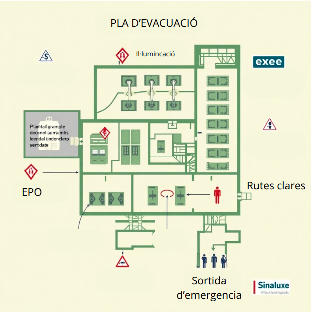

- **Diagrames, planells i fotografies de tota la seguretat física incorporada:** (Aquest punt remet als diagrames actualitzats i nous que s'han de crear, tal com s'ha descrit a l'apartat 1.1 "Planells, dibuixos, diagrames...")
  - **Plànol de Seguretat Física:** Mostrarà la ubicació de les càmeres de videovigilància (amb el seu camp de visió), els sensors d'incendi, els capçals d'extinció de gas, els lectors de control d'accés a la porta, i els botons EPO.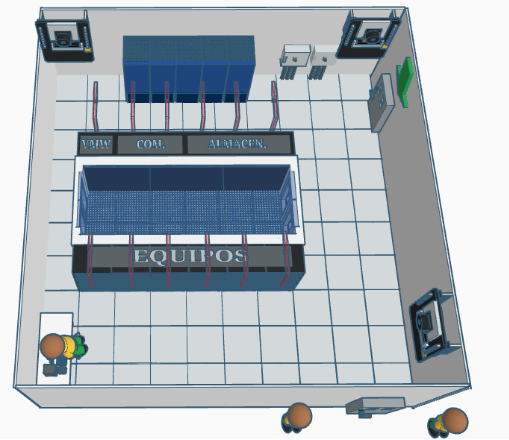

##### **1.4.2 Lògica:**
- **Restricció d'accés per autorització:** La seguretat lògica es basa en el principi del mínim privilegi (PoLP):
  - **Control d'Accés Basat en Rols (RBAC):** S'implementarà un sistema de control d'accés basat en rols (RBAC) per a tots els sistemes i aplicacions. Els usuaris només tindran els permisos estrictament necessaris per dur a terme les seves funcions (principi del mínim privilegi).
  - **Gestió d'Identitat i Accés (IAM):** S'utilitzarà un sistema IAM centralitzat (com Active Directory o LDAP) per gestionar les identitats d'usuari i la seva autenticació a través de tots els sistemes del CPD, simplificant la gestió i millorant la seguretat.
  - **Autenticació Forta:** Es requerirà l'ús de contrasenyes complexes i, quan sigui possible, l'autenticació de dos factors (2FA) per a l'accés a sistemes crítics.
  - **Auditoria d'Accés:** Totes les accions dels usuaris dins dels sistemes seran registrades per a auditories de seguretat periòdiques.

- **Firewalls:**\

  - **Desplegament Perimetral:** S'instal·laran firewalls de nova generació (NGFW) al perímetre de la xarxa, com pfSense o FortiGate (amb llicència comercial per a característiques avançades), per protegir el CPD d'amenaces externes.
  - **Firewalls de Capa 7:** Aquests firewalls operaran a la capa 7 (aplicació), permetent una inspecció profunda del tràfic per detectar i bloquejar atacs complexos, programari maliciós i intrusions.
  - **Funcionalitats:** Inclouran IPS/IDS (Intrusion Prevention/Detection Systems), VPN (Virtual Private Network) per a accés remot segur, filtrat de contingut i control d'aplicacions.
  - **Redundància:** Els firewalls es desplegaran en una configuració d'alta disponibilitat (actiu-passiu o actiu-actiu) per garantir la continuïtat de la protecció.
  - **Segmentació de Xarxa:** S'utilitzaran regles de firewall internes per segmentar la xarxa en diferents VLANs (e.g., VLAN de servidors, VLAN de gestió, VLAN de backup), aïllant el trànsit i limitant el moviment lateral d'un atacant en cas de bretxa.

- **Monitorizació:**\

  - **Monitorització Integral:** S'implementarà una solució de monitorització exhaustiva utilitzant Zabbix per a la monitorització de sistemes i xarxes (CPU, RAM, ús de disc, tràfic de xarxa, disponibilitat de serveis) i l'ELK Stack (Elasticsearch, Logstash, Kibana) per a la centralització, anàlisi i visualització de logs.
  - **Objectius:** L'objectiu és assegurar l'eficiència, la seguretat i la continuïtat operativa del CPD, detectant anomalies i problemes abans que afectin els serveis.
  - **Alertes Personalitzades:** Es configuraran alertes personalitzades (via correu electrònic, SMS o integració amb un sistema de ticketing) per a qualsevol esdeveniment crític, com sobrecàrrega de servidors, fallades de servei, intents d'accés no autoritzat o canvis de temperatura.
  - **Quadres de Comandament (Dashboards):** Es crearan quadres de comandament interactius a Kibana per visualitzar l'estat del CPD en temps real i generar informes periòdics sobre rendiment, seguretat i ús de recursos.

- **Còpies de seguretat/Backups:**\

  - **Mètode 3-2-1:** S'aplicarà rigorosament el mètode de backup 3-2-1:
    - **3 Còpies de Dades:** Mantenir almenys tres còpies de totes les dades (la còpia de producció i dues còpies de seguretat).
    - **2 Tipus de Mitjà:** Les còpies s'emmagatzemaran en dos tipus de mitjans diferents (e.g., discs durs locals i emmagatzematge en el núvol).
    - **1 Còpia Fora de Lloc (Offsite):** Una de les còpies de seguretat s'emmagatzemarà en una ubicació geogràficament diferent per a protecció contra desastres locals.
  - **Freqüència i Retenció:**
    - **Dades Crítiques (streaming/BD):** Backups incrementals cada hora, amb backups complets diaris. Retenció de 7 dies per als incrementals, 30 dies per als diaris.
    - **Dades Menys Crítiques:** Backups diaris, amb retenció de 60 dies.
    - **Backups Anuals/Arxiu:** Còpies de seguretat a llarg termini per a requisits de compliment.
  - **Solució de Backup:** S'utilitzarà Veeam Backup & Replication per a la virtualització i l'emmagatzematge local en els servidors de backup Dell PowerEdge R540. Per a la còpia offsite, s'utilitzarà AWS S3 Glacier per a l'emmagatzematge de dades a llarg termini i de baix cost.
  - **Pla de Recuperació de Desastres (DRP):** La política de backups forma part integral d'un DRP més ampli, que defineix els Objectius de Temps de Recuperació (RTO) i els Objectius de Punt de Recuperació (RPO) per a cada servei, així com els procediments de restauració.

- **RAIDS:** S'implementaran configuracions RAID per garantir la redundància i la disponibilitat de les dades en cas de fallada de disc:
  - **Servidors de Producció (HPE ProLiant DL380 Gen10):**
    - **RAID 10:** Els 8 x 3.84TB SAS SSDs es configuraran en RAID 10. Aquesta configuració ofereix un excel·lent rendiment tant en lectura com en escriptura, i una alta tolerància a fallades (pot fallar un disc de cada parell mirall sense pèrdua de dades), ideal per a càrregues de treball d'alta I/O com bases de dades i streaming.
    - **Hot Spares:** Es configuraran discs de recanvi "hot spare" dins de cada array RAID, que prendran el relleu automàticament en cas de fallada d'un disc.
  - **Servidors de Backup (Dell PowerEdge R540):**
    - **RAID 6:** Els 12 x 10TB SATA HDDs es configuraran en RAID 6. Aquesta opció proporciona una gran capacitat d'emmagatzematge i la capacitat de suportar la fallada de fins a dos discos simultàniament sense pèrdua de dades, òptim per a l'emmagatzematge de grans volums de còpies de seguretat.
    - **Hot Spares:** També es configuraran hot spares per a aquests arrays. La selecció del nivell RAID es justifica per la necessitat d'equilibri entre rendiment, capacitat i redundància segons el rol de cada servidor.
####
####
####
####
####
####
####
####
#### **1.4.3 Prevenció de riscos laborals:**
- **Mesures aplicades en matèria de prevenció de RRLL en el CPD:** La seguretat del personal que opera al CPD és una prioritat. S'aplicaran les següents mesures de prevenció de riscos laborals:
  - **Espais Segurs:** Les vies de pas i les zones de treball dins del CPD seran amples i estaran clarament senyalitzades per evitar obstacles i caigudes.
  - **Il·luminació Adequada:** S'assegurarà una il·luminació suficient i uniforme per reduir la fatiga visual i millorar la seguretat.
  - **Equipament de Protecció Individual (EPI):** Es proporcionarà EPI adequat per a tasques de manteniment (e.g., guants aïllants per a treballs elèctrics, calçat de seguretat, protecció auditiva si cal).
  - **Etiquetatge i Aïllament Elèctric:** Tots els equips elèctrics estaran correctament etiquetats. Es seguiran procediments estrictes de bloqueig/etiquetatge (Lockout/Tagout - LOTO) per a qualsevol manteniment elèctric, assegurant que l'energia no es pugui restablir accidentalment.
  - **Ergonomia:** Els punts de treball temporals (e.g., consoles mòbils, seients per a tasques d'instal·lació) s'adaptaran ergonòmicament per minimitzar la tensió i el risc de lesions per moviments repetitius.
  - **Formació Contínua:** El personal rebrà formació regular sobre procediments d'emergència (incendis, evacuació), seguretat elèctrica i manipulació segura d'equips pesats.
  - **Nivells de Soroll:** Es monitoritzaran els nivells de soroll dins del CPD. Si superen els límits acceptables, s'implementaran mesures per reduir-los (e.g., panells d'absorció de soroll, equips més silenciosos) o s'obligarà l'ús de protecció auditiva.
  - **Primers Auxilis:** Es disposarà d'un equip de primers auxilis i personal format en tècniques de reanimació i primers auxilis en cas d'emergència.
####
####
####
####
####
####
##
## **1.5 Sostenibilitat:**
L'objectiu és que el CPD de "Innovate Tech" sigui un model d'eficiència i responsabilitat ambiental.

- **Com optimitzar el consum d’energia:**\

  - **Monitorització del PUE:** S'implementarà una monitorització constant de la PUE (Power Usage Effectiveness), amb un objectiu d'assolir una PUE ideal de <1.4. Això es farà mitjançant sensors intel·ligents i eines de gestió energètica que permetran identificar ineficiències i prendre mesures correctores.
  - **Virtualització:** S'aprofitarà al màxim la virtualització de servidors (VMware ESXi i Proxmox VE) per consolidar múltiples càrregues de treball en menys servidors físics, reduint el consum d'energia per cada càrrega de treball individual i el footprint físic.
  - **Optimització de Càrregues de Treball:** S'implementaran polítiques de gestió de càrregues de treball per assegurar que els servidors no estiguin ociosos o subutilitzats. S'exploraran tecnologies com la migració de màquines virtuals en calent (VMotion) per reequilibrar la càrrega entre servidors i permetre l'apagada de servidors físics infrautilitzats durant períodes de baixa demanda.
  - **Power Capping:** Els servidors estaran configurats amb funcionalitats de "power capping" per limitar el seu consum màxim d'energia, evitant pics inesperats i optimitzant l'ús del sistema elèctric.

- **Ús d’energia verda pel CPD:**\

  - **Panells Solars:** S'avaluarà la viabilitat d'instal·lar panells solars fotovoltaics a la coberta de l'edifici per a l'autoconsum, proporcionant una part significativa de l'energia necessària per al CPD i reduint la dependència de la xarxa. Es realitzarà un estudi d'irradiació solar i espai disponible.
  - **Contractació d'Energia Renovable Certificada:** En cas de no poder cobrir el 100% de la demanda amb energia solar, o com a complement, es contractarà energia elèctrica directament de proveïdors que garanteixin que la seva energia prové exclusivament de fonts 100% renovables certificades (e.g., eòlica, hidràulica, solar). Això es farà mitjançant Power Purchase Agreements (PPAs) o programes de compra de "green energy" de la companyia elèctrica.
  - **Certificacions:** S'explorarà l'obtenció de certificacions com el "Green Power Partnership" o similars que validin l'ús d'energia renovable i pràctiques sostenibles.

- **Estalvi en longitud de cablejat:**\

  - **Disseny Estratègic:** La planificació acurada de la distribució dels racks i la ubicació dels patch panels minimitzarà la longitud necessària del cablejat de coure i de fibra òptica.
  - **Fibra Òptica per a Backbone:** L'ús prioritari de fibra òptica per a les connexions de backbone entre racks i per a enllaços d'alta velocitat no només millora el rendiment sinó que també redueix el volum de coure necessari, que és un material amb major impacte ambiental en la seva producció.
  - **Optimització d'Armaris:** La configuració de "cold aisle containment" i la ubicació dels equips en armaris dissenyats específicament per a CPDs amb passadissos tècnics integrats permetrà una gestió més eficient dels cables, reduint la longitud i els materials innecessaris, optimitzant costos i millorant l'eficiència de transmissió.

- **Sistemes de circulació d’aire que aprofitin condicions naturals:**\

  - **Free Cooling:** Tal com s'ha descrit anteriorment, el sistema de "free cooling" aprofitarà les temperatures externes més baixes per refredar la sala de forma natural, reduint significativament l'ús de compressors d'aire condicionat.
  - **Contenció de Passadissos (Cold Aisle Containment - CAC):** El disseny del CPD inclourà la contenció dels passadissos freds. Això implica tancar els passadissos on els equips prenen l'aire fred, assegurant que tot l'aire fred produït pels sistemes de climatització sigui dirigit directament als equips. L'aire calent expulsat pels equips s'evacua a través del passadís calent, evitant la barreja de l'aire i millorant dràsticament l'eficiència tèrmica.

- **Parada d’equips de comunicacions quan no hi ha càrrega:**\

  - **Energy Efficient Ethernet (EEE):** Els switches de xarxa seran configurats amb Energy Efficient Ethernet (EEE) o "Green Ethernet" (IEEE 802.3az), que permet que els ports de xarxa redueixin el seu consum d'energia en períodes d'inactivitat o baixa utilització.
  - **Gestió de Potència de Servidors:** Els servidors virtualitzats estaran configurats amb polítiques de gestió d'energia que permetran que els processadors i altres components entrin en estats de menor consum quan la càrrega de treball sigui baixa, sense comprometre la disponibilitat del servei. Per als serveis de streaming crítics, es trobarà un equilibri entre l'estalvi d'energia i la necessitat de resposta instantània.

- **Equips de baix consum energètic:**\

  - **Certificació Energy Star:** Tots els nous equips adquirits (servidors, switches, SAIs, etc.) seran models amb certificació Energy Star, garantint que compleixen amb uns estàndards d'eficiència energètica.
  - **SSDs:** L'ús generalitzat d'unitats d'estat sòlid (SSDs) en lloc de discos durs tradicionals no només millora el rendiment, sinó que també redueix significativament el consum d'energia i la generació de calor.
  - **Fonts d'Alimentació Eficients:** Els servidors i altres equips estaran equipats amb fonts d'alimentació amb certificació 80 Plus Platinum o Titanium, que garanteixen una eficiència de conversió d'energia superior al 90% (o 94% per Titanium) amb diverses càrregues.
  - **Processadors Eficients:** La selecció de processadors (Intel Xeon Silver) es basa també en la seva eficiència energètica per a la càrrega de treball esperada.
####
####
####
####
####
####
##
## **1.6 Implementació:**
La implementació del CPD de "Innovate Tech" es basarà en un enfocament de "cloud-first" amb una infraestructura híbrida per a determinats serveis, aprofitant la flexibilitat i escalabilitat del núvol AWS.

La implementació del CPD al núvol AWS utilitzarà els següents serveis (a més dels serveis d'àudio, vídeo i bases de dades que es valoraran en altres blocs):

1. **Amazon EC2 (Elastic Compute Cloud):** Per a la provisió de màquines virtuals escalables que allotjaran aplicacions web, servidors de gestió i altres serveis computacionals. Es faran servir instàncies optimitzades per a computació o memòria segons la càrrega de treball.
1. **Amazon RDS (Relational Database Service):** Per a la gestió de les bases de dades relacionals del projecte, s'ha implementat Amazon RDS. Aquest servei gestiona automàticament les tasques d'administració de bases de dades (com ara pegats, backups, replicació i escalabilitat), permetent-nos centrar-nos en el desenvolupament i la funcionalitat de les bases de dades sense la complexitat de la gestió d'infraestructura subjacent. S'ha escollit el motor de base de dades que millor s'adapta als requisits de "Innovate Tech".
1. **Amazon VPC (Virtual Private Cloud):** Per crear una xarxa virtual aïllada dins d'AWS, on es desplegaran tots els recursos. Permetrà definir rangs d'IP privats, subxarxes, taules de rutes i gateways de xarxa per aïllar i securitzar el trànsit.

**Arquitectura General a AWS (Diagrama de Xarxa Lògica de Cloud):** (Això requeriria un nou diagrama que mostri, a alt nivell, la VPC amb les seves subxarxes públiques i privades, els EC2 dins de les subxarxes privades darrere d'un Load Balancer, S3 per a emmagatzematge, i CloudFront per a la distribució de contingut, etc.)
####
####
####
####
####
####
####
#### **Evidencias dels serveis utilitzats en Innocatech:**

DNS:

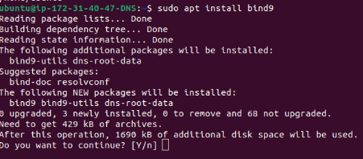

Instalació DNS.

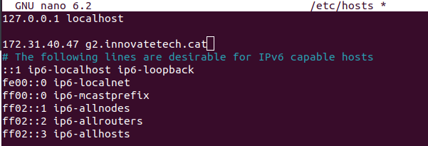

Fico com la IP del servidor el nostre domini.

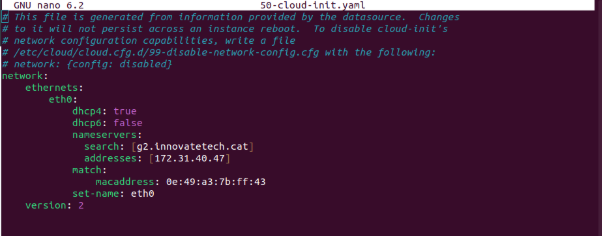

Edito al .yaml com correspon.

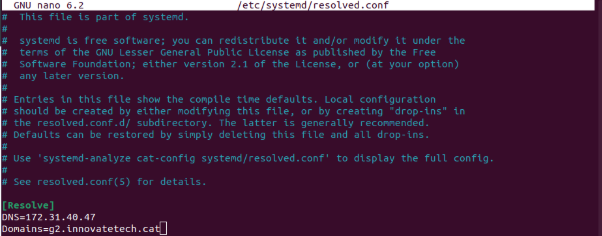

Edito el resolved.cond i fico la IP del servidor i el nostre domini.

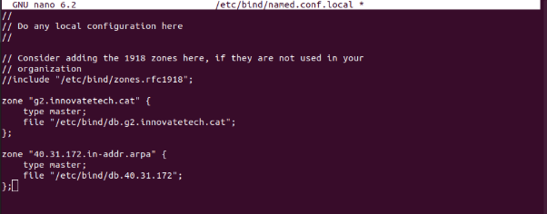

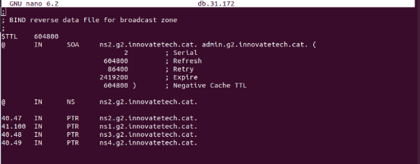

Configuració el DNS.

DHCP:

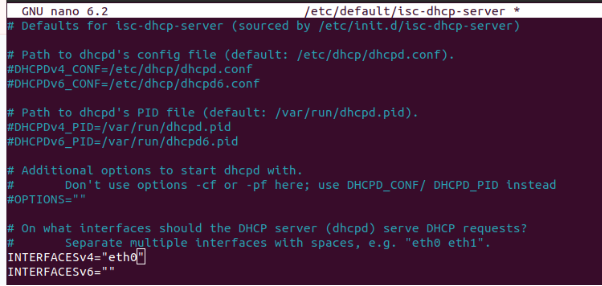

Fiquem el intefaç de xarxa corresponen.

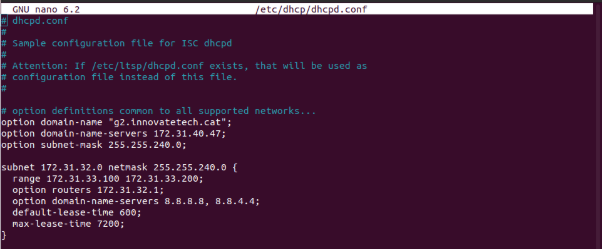

Configurem el DHCP amb el rang de IPs que volem donar.

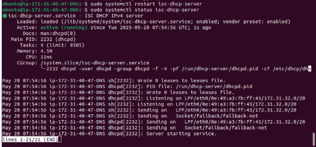

Comprovació

FTP:

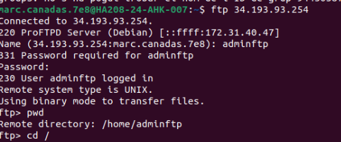

Comprovació de què funciona l'ftp i l'usuari virtual creat (adminftp).

NGINX:

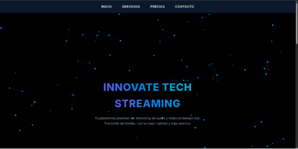

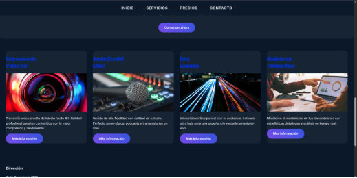

Comprovació de què el servei NGINX funciona com es pot veure la web funciona perfectament.

OPENFIRE I SPARK:

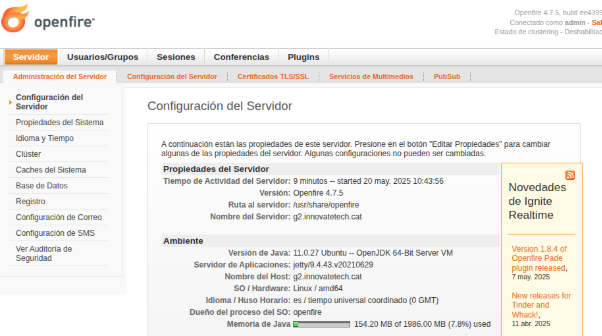

Com es pot comprovar funciona correctament el servei openfire.

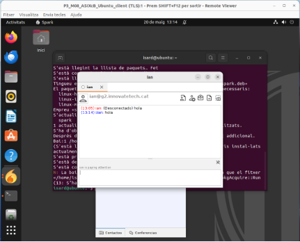

I el spark també funciona correctament ja que podem enviar missatges entre els usuaris creats.

## **1.7 Investigar i comparar**
Per avaluar l'eficiència energètica i les solucions de CPD en el núvol, hem investigat i comparat AWS amb altres proveïdors líders com Microsoft Azure i Google Cloud Platform (GCP).

**Criteris de Comparació:**

- **PUE (Power Usage Effectiveness):** Mesura l'eficiència de l'ús d'energia del CPD. Un valor més proper a 1.0 indica major eficiència.
- **Ús d'Energies Renovables:** Percentatge d'energia de fonts renovables que utilitzen els seus centres de dades.
- **Certificacions i Iniciatives de Sostenibilitat:** Programes específics i certificacions que avalen les seves pràctiques verdes.
- **Eines d'Eficiència Energètica i Gestió del Carboni:** Utilitats i dashboards que ofereixen als usuaris per monitoritzar i reduir la seva empremta de carboni.
- **Solucions de CPD Administrats (Managed Services):** Com aborden els requisits de seguretat física, lògica i escalabilitat.

|**Característica**|**AWS (Amazon Web Services)**|` `**Services)Microsoft Azure**|**Google Cloud Platform (GCP)**|
| :- | :- | :- | :- |
|PUE|Informen de millores contínues, amb valors típics en el rang de 1.1 a 1.2 per als seus darrers centres de dades. Objectiu de 1.05.|Apunten a PUEs per sota de 1.25. Inversió en millores de refrigeració i gestió de l'aire.|Són líders en PUE, amb alguns centres de dades que assoleixen valors propers a 1.1. Inversió en IA per a l'optimització de la refrigeració.|
|**Ús d'Energies Renovables**|Compromís d'arribar al 100% d'energia renovable per al 2025 (actualment al voltant del 85%). Inversió en projectes solars i eòlics.|Objectiu del 100% per al 2025. Inversió activa en projectes d'energia renovable a gran escala.|Ha aconseguit el 100% d'energia renovable per al 2017 i es manté amb aquest objectiu. S'esforcen per operar amb energia lliure de carboni 24/7 per al 2030.|
|**Certificacions i Iniciatives**|Clean Energy Buyers Alliance (CEBA), Green Power Partnership. Desenvolupament de xips personalitzats (Graviton) per a major eficiència.|Lidera en certificacions ISO 50001, LEED, i es compromet amb iniciatives com RE100.|Pioner en l'ús d'IA per a l'optimització del refredament dels CPD. Membre de RE100.|
|**Eines d'Eficiència/Carboni**|**AWS Carbon Footprint Tool:** Permet als usuaris veure la seva empremta de carboni associada a l'ús d'AWS.|**Microsoft Cloud for Sustainability:** Ofereix eines per mesurar, informar i reduir les emissions. **Azure Cost Management:** Inclou reports d'ús energètic.|**Carbon Footprint in GCP Console:** Proporciona informació en temps real sobre les emissions del projecte. **Active Assist:** Recomanacions d'optimització.|
|**Solucions de CPD Administrats**|Ampli ventall de serveis (EC2, S3, RDS, VPC, CloudWatch, IAM). Ofereixen una alta disponibilitat global, seguretat física en data centers.|Serveix com a IaaS (VMs, Storage), PaaS (SQL Database, App Service), etc. Robustes mesures de seguretat física i lògica, amb certificacions globals.||

|Varis serveis de compute (Compute Engine, GKE), emmagatzematge (Cloud Storage), xarxa (VPC). Enfocament en seguretat i xarxa globalment distribuïda.|
| :- |

||||Exportar a Hojas de cálculo|
| :- | :- | :- | :- |

Conclusió de la Comparació:

Els tres proveïdors de núvol són líders en sostenibilitat i eficiència energètica, amb compromisos ferms cap a l'energia renovable i la reducció del carboni.

- Google Cloud Platform (GCP) destaca per haver assolit el 100% d'energia renovable des de fa anys i per la seva innovació en l'ús de la IA per optimitzar la refrigeració. La seva eina "Carbon Footprint" és molt transparent i útil.
- Microsoft Azure també té un compromís fort amb el 100% d'energia renovable i ofereix eines de gestió de la sostenibilitat robustes.
- AWS està avançant ràpidament cap al seu objectiu del 100% i continua invertint en eficiència, destacant el seu xip Graviton que redueix el consum. La seva eina de petjada de carboni és un gran actiu.

Per a "Innovate Tech", la selecció d'AWS es justifica no només per la seva eficiència energètica i compromís verd, sinó també per la seva àmplia gamma de serveis per a contingut digital i streaming (com CloudFront, Elemental MediaServices, etc.), així com la seva maduresa i ecosistema, que s'alineen amb les necessitats del projecte. La capacitat d'AWS per oferir serveis de CPD administrats (EC2, S3, VPC, etc.) amb la seva infraestructura global i certificacions de seguretat (ISO 27001, SOC 2, etc.) cobreix àmpliament els requisits de seguretat física i lògica esmentats.

#

# **2. Evidencia implantació dels serveis d'àudio i vídeo**

2\.1 SERVEI D’AUDIO

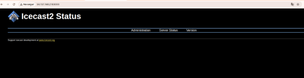

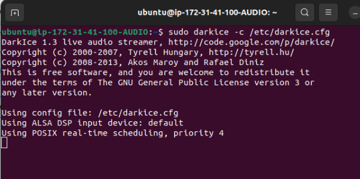

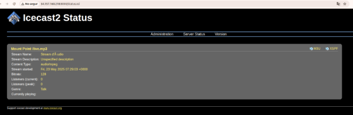

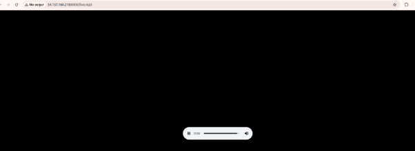

2\.2 SERVEI VIDEO:

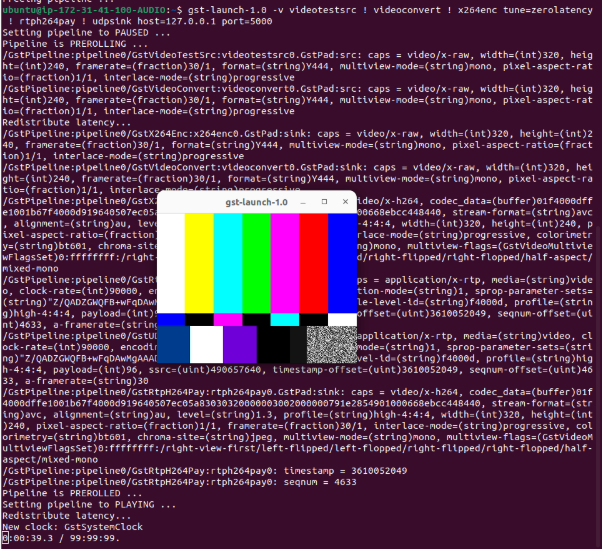

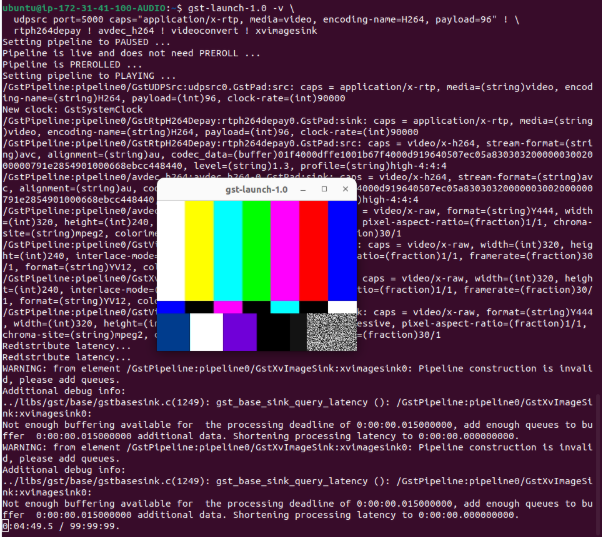

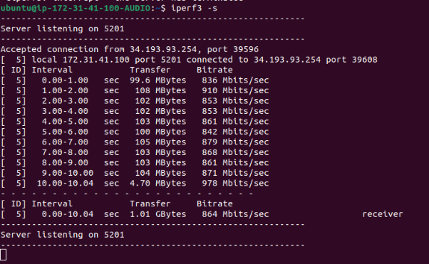
# **3. Evidencia disseny i implementació d’una base de dades**

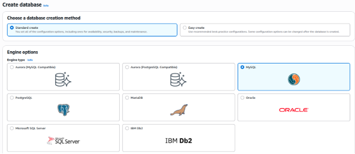

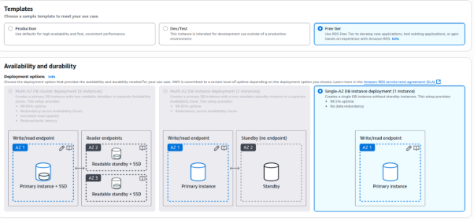

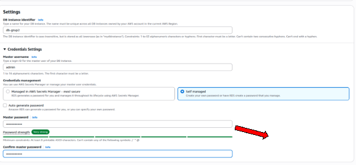

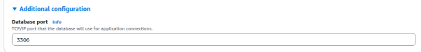

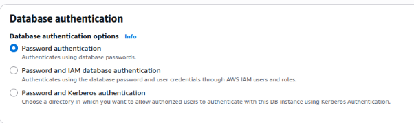

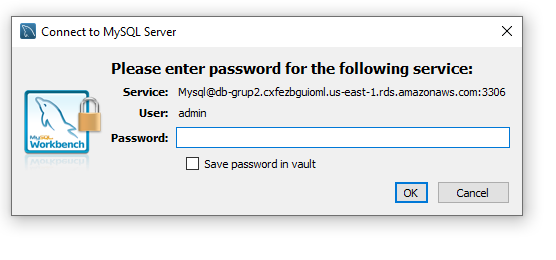

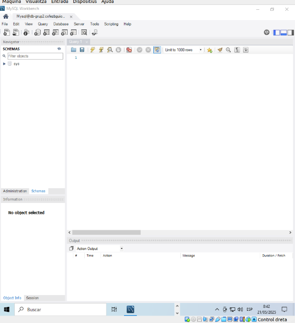

**Implementación BD a MYSQL**

**MODELO ENTIDAD-RELACIÓN:**

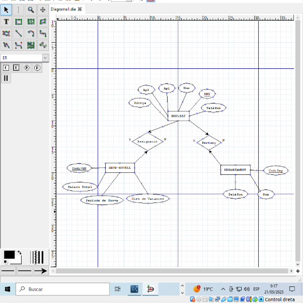

**MODELO RELACIONAL:**

**Taula Empleats (DNI, Nom, Cognoms, Adreça, Telèfon, Departament\_Codi, GrupNivell\_Codi)**\

**Taula Departaments (CodiDep, Nom, Telèfon)**\

**Taula Grups-Nivells (CodiGN, Salari\_Total, Periode\_Prova, Dies\_Vacances)**

**MODELO MySQL:**

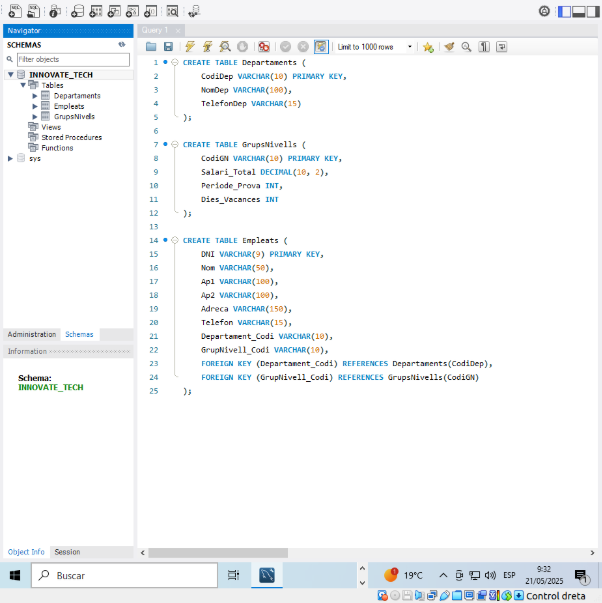

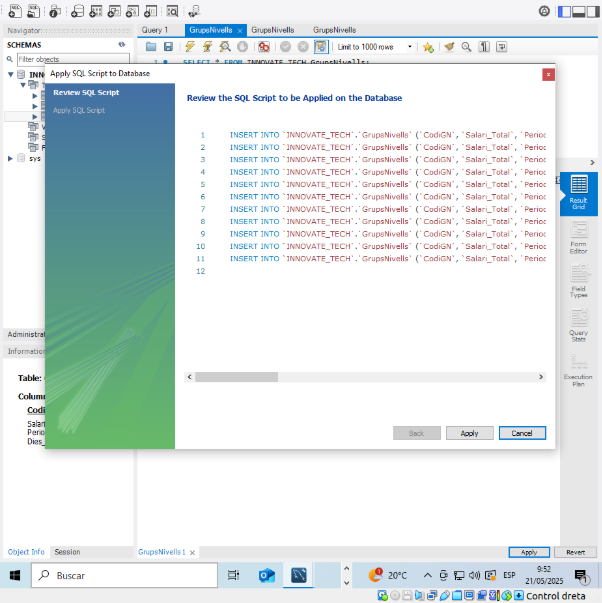

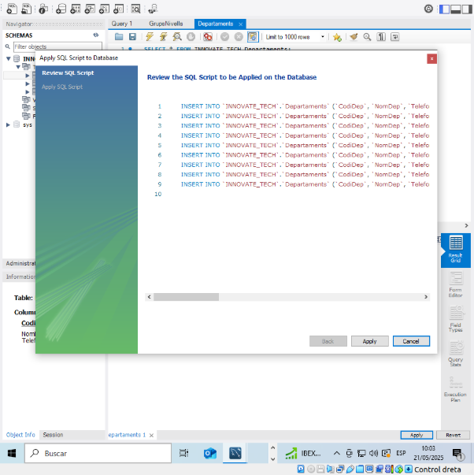

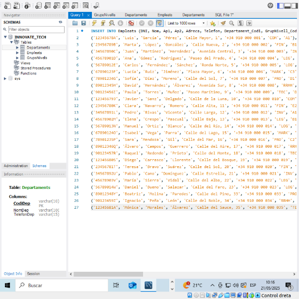

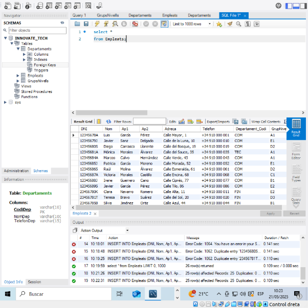

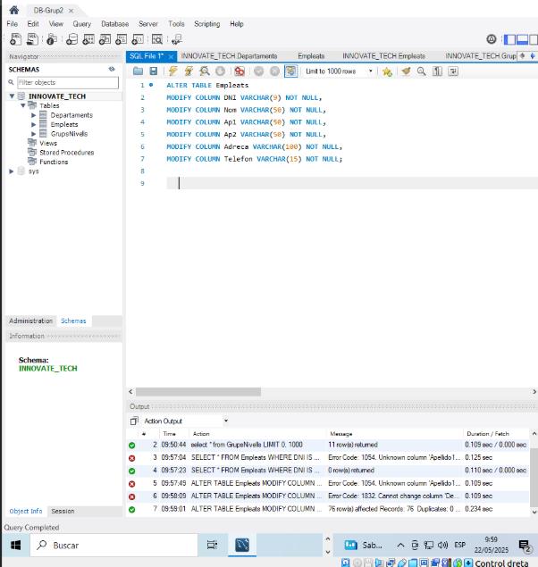

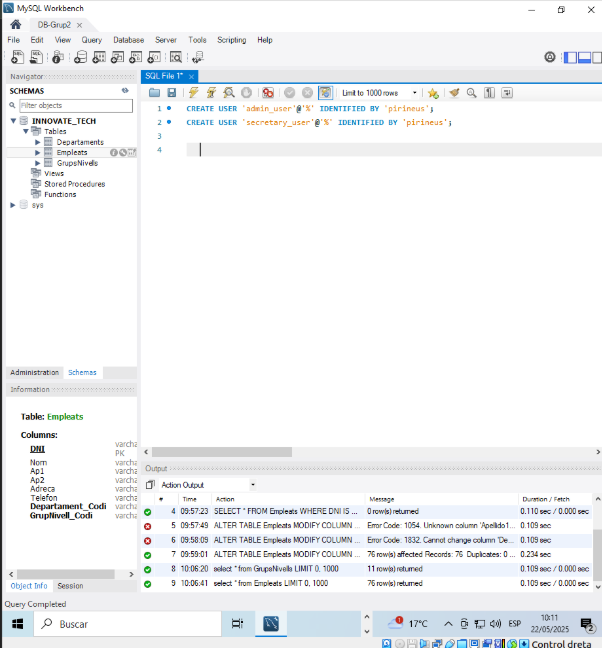

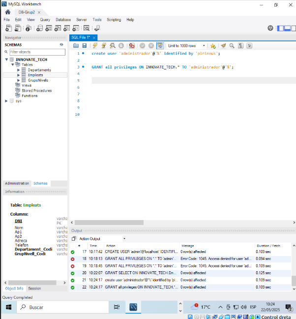

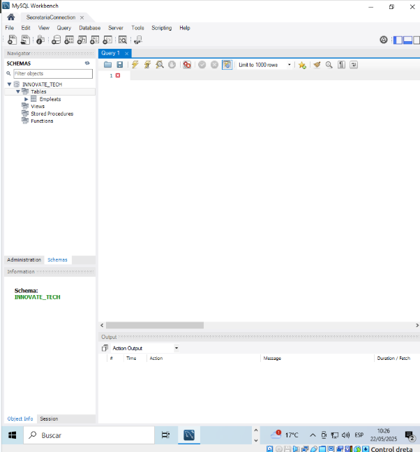

**La base de datos está normalizada porque:**

1. **No tiene redundancia innecesaria (cumple 1NF).**\

1. **No existen dependencias parciales (cumple 2NF).**\

1. **No hay dependencias transitivas entre los atributos (cumple 3NF).**\

**Esto garantiza que los datos están estructurados de manera eficiente, evitando inconsistencias y facilitando la escalabilidad de la base de datos.**

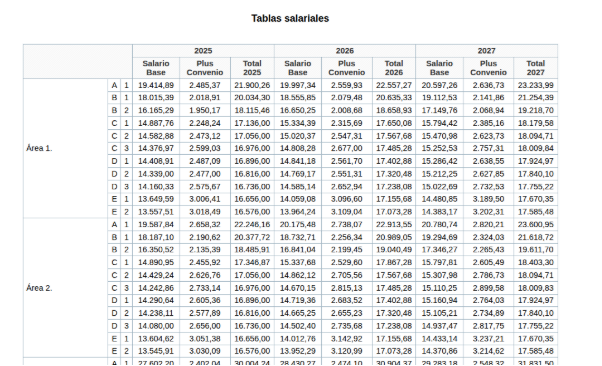

[**https://www.boe.es/diario_boe/txt.php?id=BOE-A-2025-7766](https://www.boe.es/diario_boe/txt.php?id=BOE-A-2025-7766)** 
##

## **CREACIÓ DE BACKUPS:**
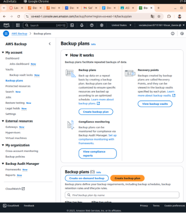

1. **BACKUPS DE EC2:**

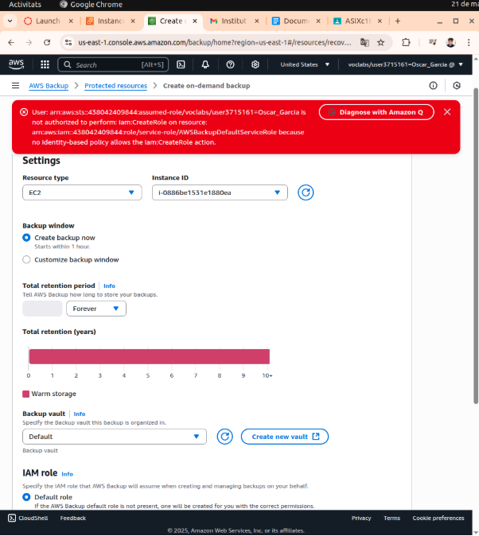

1. **BACKUP DE DB:**

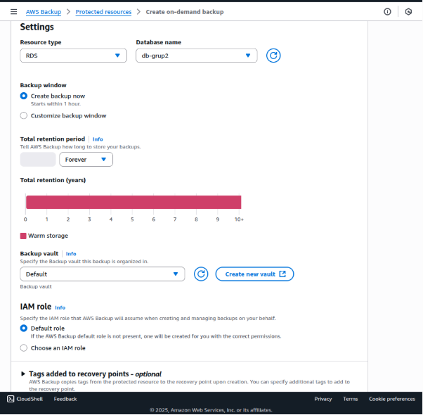

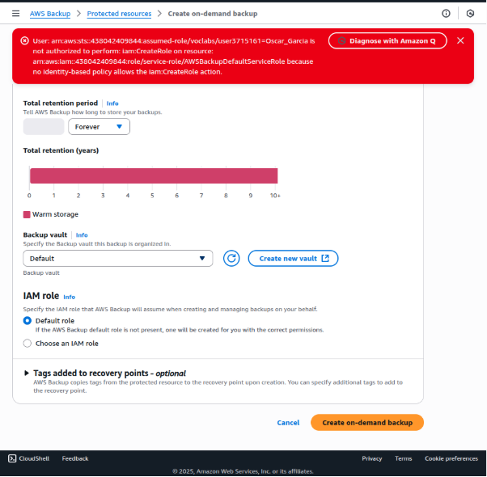

Els backups es fan automáticamente en AWS, ja que aquest proveïdor conté les còpies de seguretat implementades de forma predeterminada i ho podem comprovar en l’apartat de RDS (system) i allà estan les còpies de seguretat.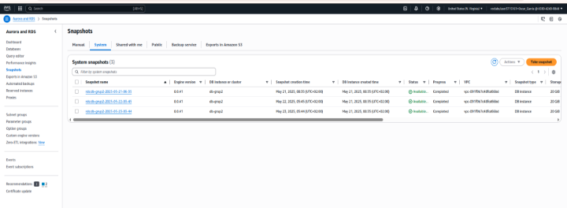

#

# **4. Sostenibilitat**

**1. Identificació de recursos a AWS:**

Hem fet servir el proveeïdor de núvol AWS, per tant els servers que tenim son virtuals i no físics. Aquests son 2 EC2 de model t2.large i una db de model db.t4g.micro.
####
#### **Instàncies EC2**
1. **t2.large (x2):**\

   1. **Característiques:** 2 vCPU, 8GB RAM.
   1. **Consum estimat:** 40-50W/h per instància.
   1. **Consum total:** 2×0.045 kW×24h=2.16 kWh/dia
1. **Base de dades db.t4g.micro:**\

   1. **Característiques:** Basada en ARM (molt eficient energèticament), 2 vCPU, 1 GB RAM.
   1. **Consum estimat:** 5-10W/h.
   1. **Consum total:** 0.01 kW×24 h=0.24 kWh/dia

**2. Estimació de petjada de carboni**

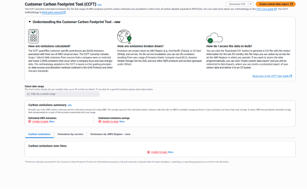

Per a calcular les emissions, utilitzem un factor mitjà global de 0.233 kg CO₂

Instàncies EC2 (t2.large):

- 2.16 kWh/dia×0.233 kg CO₂ eq./kWh=0.503 kg CO₂ 

Base de dades (db.t4g.micro):

- 0.24 kWh/dia×0.233 kg CO₂ eq./kWh=0.056 kg CO₂

Total emissions diàries:

- 0.503+0.056=0.559 kg CO₂

**3. Mesures d'optimització:**
#### A. Optimització de les instàncies EC2:
1. Migrar a instàncies més eficients:
   1. t4g.large: ARM (Graviton2) consumeix fins a un 60% menys energia que les t2.large.
   1. Estalvi energètic estimat: fins a 20W/h per instància.
1. Utilitzar Elastic Load Balancer i Auto Scaling:
   1. Manté només el nombre necessari d’instàncies actives segons la càrrega.
#### B. Optimització de la base de dades:
1. Escalar automàticament:
   1. Activa Aurora Serverless si la càrrega és intermitent o variable, ajustant els recursos dinàmicament.

1. Triar regions amb energia renovable:
   1. AWS Ireland (eu-west-1) o AWS Oregon (us-west-2) utilitzen fins al 100% d’energia renovable.
#### C. Optimització del tràfic:
- CloudFront CDN: Redueix el tràfic directe des de les instàncies EC2 cap als usuaris finals.

**4. Impacte de les millores**

Amb migració a t4g.large i altres optimitzacions:

- Consum per EC2 → Reducció de fins a un 60% (passant de 45W a 18W/h per instància).
- Emissions totals → Potencial reducció del 40-50%.

Així, el projecte serà més sostenible, alhora que redueix costos operatius.

# **5. Creació i configuració d'un SIEM (Security Information and Event Manager)*

**1. Estructura propuesta**

La nostra estructura proposada es:

  - Elasticsearch + Kibana + Logstash = Rebre i analisis de logs (Server3).
  - EC2 + Filebeat + Systemmodule = Recolleix els logs i els envia al elastic (Server 1 i Server2).

**2. Instalació Elasticsearch**

Pàgina 62 de 62

[ref1]: Aspose.Words.8a496ea5-6372-4585-a41e-1376b0ff93eb.031.png
